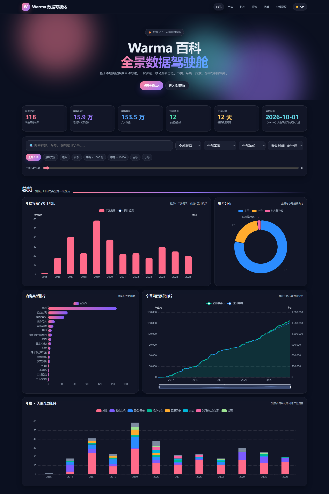

<div align="center">

# 🎬 Warma 百科

**B站UP主 [Warma](https://space.bilibili.com/53456)（主号）× [warma养鸽场](https://space.bilibili.com/106320250)（小号）**

视频数据 · 可视化 · 弹幕分析 · 自动更新


**[🌐 在线预览](https://aigooz.github.io/warma-encyclopedia/)** · **[📖 使用说明](#-使用)** · **[🛠 项目结构](#-项目结构)**

</div>

---

## 📊 可视化网站

用浏览器打开 `site/index.html` 即可，包含 **20+ 交互式图表**：

| 模块 | 内容 |
|------|------|
| 📈 年度趋势 | 投稿频率、时长变化、年度对比 |
| 🍩 类型分布 | 内容类型占比与演变 |
| 🔥 弹幕分析 | 峰值时间、热词、互动率 |
| 🕐 发布时钟 | 各时段投稿习惯 |
| 🏷 关键词网络 | 标题关键词共现关系 |
| 🖼 封面画廊 | 按类型/年份浏览封面 |
| 📐 算法分析 | 间隔预测、趋势拟合 |



### ⚡ 性能

站点把评论数据从首屏 `data.js` 中拆出，并在用户接近评论区或打开视频详情时按需加载。首次渲染只需加载核心视频数据与图表库，避免一次性下载数 MB 的评论文本。

## 🛠 项目结构

```
warma-encyclopedia/
├── site/                       # 🌐 可视化网站
│   ├── index.html              #    主页面
│   ├── app.js                  #    ECharts 图表逻辑
│   ├── data.js                 #    首屏视频数据 (359)
│   ├── data-comments.js        #    评论数据（接近评论区时按需加载）
│   ├── style.css               #    样式
│   └── vendor/                 #    第三方库
├── tools/                      # ⚙️ 自动化工具
│   ├── update.py               #    全自动更新入口
│   ├── build_site_data.py      #    生成 data.js
│   ├── split_site_data.js      #    拆分首屏/评论数据
│   ├── compact_site_comments.js#    压缩评论数据字段
│   ├── enrich_xlsx_insights.py #    Excel 增强
│   ├── fetch_danmaku.py        #    弹幕抓取
│   ├── bili_api.py             #    B站 API 封装
│   ├── login.py                #    扫码登录
│   └── ...
├── charts/                     # 📊 静态图表
├── subtitles/                  # 📝 字幕 JSON
├── .github/workflows/          # 🚀 CI/CD
├── registry.json               # 视频注册表
├── config.ini                  # 配置（不入库）
│
├── 一键更新百科.bat              # 交互式更新
├── 一键更新表格.bat              # Excel 同步
├── 同步到GitHub.bat             # 手动推送
└── 使用说明.md
```

## 🚀 使用

### 一键更新
```bash
# 交互式菜单（全自动 / 字幕导入 / 查看状态）
一键更新百科.bat

# 同步 Excel 表格
一键更新表格.bat
```

### 手动更新
```bash
python tools/update.py run      # 全自动更新
python tools/update.py ingest   # 从 Inbox 导入字幕
python tools/update.py status   # 查看当前状态
```

### 配置
编辑 `config.ini`，填入 B站 Cookie（至少 `SESSDATA` + `buvid3`）：
```ini
[bili]
uid_main = 53456
uid_alt = 106320250
cookie = SESSDATA=xxx; buvid3=xxx
```

> 💡 也可运行 `python tools/login.py` 扫码自动获取。

## 📋 数据表

| 文件 | 说明 |
|------|------|
| `@Warma 相关.xlsx` | 主号 264 个视频 |
| `@warma养鸽场 相关.xlsx` | 小号 95 个视频 |
| `danmaku/` | 弹幕原始数据（本地生成，不入库） |

## 📄 License

[MIT](LICENSE)
